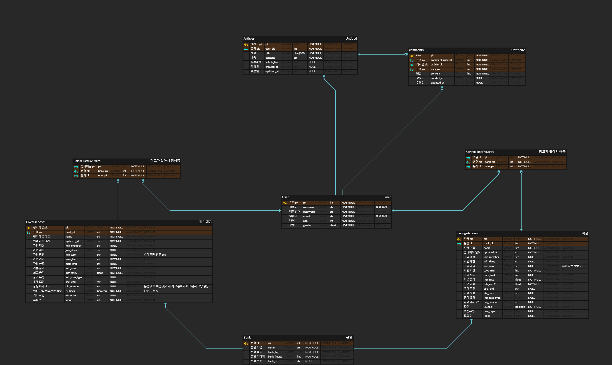
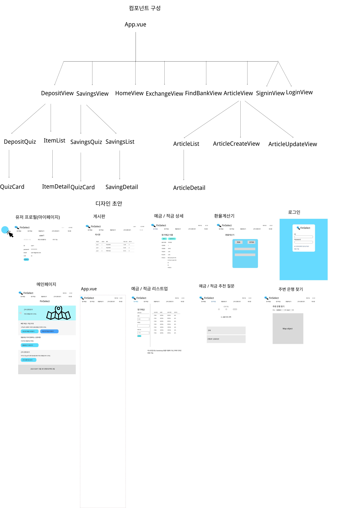

# FinSelect
금융상품 추천 서비스 (SSAFY 1학기 관통프로젝트)
### front 사용방법
1. VSCode 실행 후 프로젝트 기본 위치에서 finance-pjt 폴더로 이동 
```shell
$ cd front/finance-pjt/
```
2. (Vue, Node.js 필요) 요구사항 설치 후 실행
```shell
$ npm install
```
- env 파일 설정(finance-pjt 폴더에 .env 파일 생성)
```
VITE_KAKAOMAP_API_KEY={카카오맵 API KEY}
```
```shell
$ npm run dev
```
3. URL http://localhost:5173/ 에 프론트엔드 서버가 실행됨

### back 사용방법
0. 초기 설정
```bash
$ python -m venv venv
$ source venv/Scripts/activate
$ pip install -r requirements.txt
```
  - env 파일 설정(back 폴더에 .env 파일 생성) [참고](https://django-environ.readthedocs.io/en/latest/quickstart.html)
```
GPT_KEY = '{CHATGPT API KEY}'
EXCHANGE_KEY = '{한국수출입은행 환율정보 API KEY}'
SECRET_KEY = '{Django SECRET KEY}'
API_KEY = '{금융감독원 금융상품조회 API KEY}'

DEBUG=True
```
- back 폴더에 static 폴더 생성
1. python manage.py migrate
2. python manage.py loaddata bankDatas/bankInfo.json 
  - 크롤링된 은행 이름, 로고, url 저장
3. python manage.py saveData
  - 금융감독원 오픈 api 적금, 정기예금 상품 관련 data 갖고와 업데이트
4. python manage.py loaddata bankDatas/newtown.json 
  - 새마을금고 크롤링 상품 저장(2024.05.23) 기준
  - ~~saveData 커맨드의 경우 기존 DB와 비교하여 비교된 적이 없는 상품들은 제거하기 때문에 꼭 3번 이후 진행 필요~~
    - saveData.py 안의 기존데이터와 비교 후 삭제하는 함수를 주석처리하면 상관없음
  - 크롤링의 경우 약 만 이상의 데이터를 갖고 오기 때문에 대략 한시간 이상 걸리기 때문에 미리 준비한 데이터로 진행
   
5. python manage.py runserver


### 컴포넌트 구성
<pre>
App.vue
|
|ㅡDepositView
|   |ㅡㅡㅡㅡㅡㅡㅡ|
|   DepositQuiz  DepositList   
|   |            |
|   QuizCard     DepositDetail
|
|ㅡSavingsView
|   |ㅡㅡㅡㅡㅡㅡㅡ|
|   SavingsQuiz  SavingsList   
|   |            |
|   QuizCard     SavingDetail
|
|ㅡArticleView
|   |ㅡㅡㅡㅡㅡㅡㅡ|ㅡㅡㅡㅡㅡㅡㅡㅡㅡㅡㅡㅡㅡㅡㅡ|
|   ArticleList  ArticleCreateView        ArticleUpdateView
|   |             
|   ArticleDetail
|
|ㅡHomeView
|ㅡExchangeView
|ㅡFindBankView
|ㅡArticleView
|ㅡSigninView
|ㅡLoginView
</pre>

## Contributer
[장성일](https://github.com/cocoajoa)

[정기영](https://github.com/FlashingFuture)

## 기술 스택
공통


Frontend


Backend
  

   
#### 장고 내부 설명
##### project
- back
  - settings.py
    - 시간은 서울 기준, 스캐쥴러 구현 (시간에 따라 기능 구동)
    - sns 가입 관련 내용만 추가 (미구현)

##### app
- accounts
  - models.py
    - 프로젝트 명세에 따라 gender와 나이 항목 생성
  - views.py
    - ai 관련 함수들 넣어놓음
      - app을 따로 만드는게 사실 맞음
    - DB가 너무 커서 다 읽게는 못시킴
      - 조회수 기준, 좋아요 많이 된 기준으로 몇개만 갖고와서 분석시키게함

- articles
  - models.py 
    - 게시글과 댓글 기본 구현, views(조회수)를 저장함

  - views.py
    - 조회수 저장을 위하여 detail의 경우 get이 아닌 POST로만 받음
    - 게시글 목록 보는 것 외에는 권한이 있어야 가능하게 만듬

- bankDatas
  - models.py
    - 새마을금고의 경우 핀번호와 금융회사 코드를 얻을 수 없어 임의로 만듬
  - views.py
    - 받은 데이터에 맞추어 정렬
    - 환율 데이터 못받아오면 전날것이라도 받아오게 while 문 만듬

#### 이외
- bankDatas/utils.py 
  - 크롤링 및 금융 오픈 api를 이용한 데이터 CRUD 함수들 저장됨
- bankDatas/tasks.py 
  - 위 파일에 저장된 함수들을 통해 할 일 및 순서를 기록한 파일
    - scheduler.add_job(my_scheduled_task, trigger=CronTrigger(hour=3, minute=0))
      - 새벽 3시에 매번 돌아가게 만들어 놓음
        - 오픈 api 작동 확인함
        - 크롤링은 아직 확인 못함..
- bankDatas/management
  - python manage.py 커맨드 를 사용함, 모듈화시킴
  
## ERD


## Front components / design


## 개발 사항
예금 / 적금 추천
- 챗 봇 도입
  - 조건을 입력받아 알고리즘을 통해 그에 맞는 리스트를 백엔드에서 제공
  - 캐릭터 심리검사 컨텐츠와 같은 형식으로 유저가 친근감을 느낄 수 있도록 구성
    - 상세 질문
    - 금액(총 금액에 따라 가입가능한 상품의 변동)
    - 안정성(2금융권)
    - 최고(고점) or 기본지급(평균?)
    - 필요에 따라 추가 가능
  - 가입방법 등의 위에서 고려못한 요소는 리스트업해서 보여줄 때 버튼 선택 등으로 처리할 수 있도록 함
    

- 일정 금액 이상 시 (5000만원 넘으면 금융 보호 불가능성) 경고 표시
- 사이트에서 가장 많이 조회 / 가입(리다이렉트)된 상품 순서를 DB에 저장
  - 기본은 클릭 횟수, 가능하다면 사람들이 머문 시간까지 적용
  - 디폴트 추천은 해당 순서대로 띄움

## 개발 일정
### 프로젝트 시작 이전
05-13(월)
- 백엔드 / 프론트엔드 역할 분담, 금융 API 조사, 금융상품 추천 디자인 조사

05-14(화)
- 예 / 적금 추천 알고리즘 구상
### 05-16(목) 
- 백엔드 명세 작성
- 프론트엔드 디자인 초안 작성(명세에 맞춰 추후 수정 가능)

#### 개발 경과
#### 백엔드 ####
- 모델 구축
  - 기본적인 내용만 구축함

- 장고 staic, media 설정
  - 은행 이미지 저장 위헤

- user 모델 수정
  - 요청 사항에 맞게 email과 여러가지 추가함

- 네이버 예적금 페이지에서 이미지와 은행 이름 크롤링
  - headers와 playwright를 활용함

- 느낀 점
  - 기존 user 모델 수정하는 건 진짜 혼자서는 못할듯
    - 왜 차라리 새로 만드는 것도 답이라는지 알겠다.
  
  - 너무 완벽히 모델 짜려는 건 사치다
    - 어차피 나중에 생각날 것 같으니 적당히 필요한 것들만
  
  - fixtures에 위치를 기록하지만 은행 이미지는 미리 받아논거라 정적인 static에 넣는 것인 줄 알았는데 media에 넣는 게 일반적이라고 한다. 신기하지만 그러려니 

  - 왠만큼 크거나 찾기 어려운 것 아니면 크롤링 보단 수동으로 하는 게 나을 때가 있다고 느낌
    - 은행 이미지나 이름은 크롤링으로 하기 쉽지만 url의 경우 깔끔하게 다듬고, 작동 안하는 게 있으면 직접 바꿔줘야해서

  - 비동기가 빠르긴한데, 동기가 필요할 때도 있다.
    - 크롤링할때 async 비동기 활용하니 그냥 request, soup 쓸때보다 훨씬 빠르긴한데, click 이후 것들을 크롤링 위해서는 click 이벤트가 작동 다 되기전 까지 기다려줘야 하더라.

### 05-17(금)
#### 백엔드 ####
- 은행들의 url 확인 및 갱신

- 금융감독원 오픈 api로 정기예금 데이터 DB에 저장 기능 완료
  - 기존 예금들 중 새로 공시된 자료에 없는 것 삭제
  - api에 맞게 새로 공시된 자료 가공
  - 새로운 자료와 기존 자료 간 차이가 있는 경우 기존 데이터 삭제 후 갱신
    - 없는 경우 pass
  - 아예 새로운 자료는 업로드

- 기존과 바뀐 점
  - 적금, 정기예금 핀넘버 추가
    - 기존 자료와 새 자료간 비교를 핀넘버로 하기 위해 DB에 등록함
  - 은행 url 모델에 추가
    - 클릭시 은행 사이트로 이동시킬 수 있도록

- 느낀점
  - 소수점까지 똑같아도 컴퓨터는 다르다고 생각함 
    - float와 관련된 내용 

  - 최대한 덜 부담이 가게 짠듯.. ㅎ?

## 저녁 이후
- 금감원 오픈 api에서 baseList 순회하여 적금 base 정보 정리할때 적금 고유 코드로 정리하였는데, 저축은행 확인할 때 오류 발생

- 기존과 바뀐 점  
  
  - 은행은 다른데 적금 고유코드가 같은 경우가 발생.. 이름이 똑같은 경우 고유 코드를 똑같이 해놓은 것 같다 휴..
    - 은행 코드랑 합치는 걸로 구분하게 바꿈 (적금 고유 코드 + 은행 코드)
    
  - 이전 것과 비교가 필요하여, 예, 적금 모델에 은행 코드도 추가
    - 이러면 은행 DB를 따로 짠 의미가 약간 퇴색되긴한데, 네이버에는 존재가 확인된 은행들 중 오픈 api로 나오지 않은 얘들이 많아 그냥 저장시키는 걸로..
      - 모든 코드를 받을 수 있으면 은행 DB의 pk 값을 저걸로 수정하면 될 것 같긴한데.. 100개 언제 다 수정하나..
      - 그런 의미로 예적금과 관계를 맺은 은행 pk 값을 예적금 DB에 저장 시키기 위해 관련 dictionary를 만들었는데.. 문제는 내가 지은 은행 이름이랑 오픈 api에서 받아오는 거랑 다를 떄가 있어 충돌이 일어날 때가 있음
        - 그런 경우 터미널에 에러 뜨니, 에러 뜨는 은행 이름만 수정시키면 될듯   
 
  -  모델에 금리 유형 추가
    - 단리, 복리 계산은 안할 것 같지만, 중요하긴 하니까 추가함
    - 그리고 단리, 복리 차이만 있는게 있더라
  
  - 에러 수정(?)
      - 업데이트 날짜가 좀 이전인 데이터, 기본 금리가 0으로 기입된 데이터가 있다.
        - 업데이트 날짜가 이전이면 업데이트 하지 않도록 수정, 금리 0인건 그냥 패스

  - 모델에 isCheck (verbose_name='이전 자료 비교 여부 확인') 추가
    - 순수 백엔드 비교용 
    - 금융감독원 오픈 API 특성상 page 수를 알고 페이지마다 확인이 필요하여 처음 api 받아올 때는 페이지수만 받고 이후로 for문 돌려야되서 기존 delete 방식은 잘못됨
    - 데이터 갖고 오기 전 기존 데이터에 false 값 주고 새로운 거랑 비교했던 거나 아예 새로 생긴 건 참값으로 수정, false인 거 삭제

  - DB에 데이터 저장하는 것은 app 구동시에만 하도록 views.py 에서 기존 구문들 삭제 utils.py와 apps.py 생성 및 수정
  
- 예정인 점
  - 정기예금 외 적금도 같이 할 수 있도록 수정
  - 함수 너무 길어져서 쪼갤 수 있으면 쪼개기
  - DB 데이터 저장의 경우 하루 기준 새벽 3시정도 마다 계속 갱신할 수 있도록 내용 추가

  - 새마을금고랑, 수협 크롤링
    - 이건 오히려 오래 안걸릴지도

  - response 해주기.. (휴..)


#### 개발 경과

### 05-18(토)

#### 백엔드 ####

- 기존과 바뀐 점
  - 예적금 DB에 갖고오는건 app 구동시가 아니라 키워드로 기동하게 수정
    - views.py 수정할떄마다 받아오게 되는 걸 보니 위험하다고 느낌
    - custom command를 사용하는 방법을 찾아 장고 서버 작동 전에 DB에 저장할 수 있도록 수정함
      - migrate -> loaddata 은행 데이터 -> python manage.py saveData 로 이어지면 되게 수정함 
- 특정 시간마다 재갱신하게 수정
  - celery 말고 django_apscheduler 사용
  - 샐러리가 강력하다고 하는데 윈도우에서 4.x 이상 버전 지원이 안되고 보통 같이 사용하는 redis도 지원을 안해서 이번 프로젝트에서는 pass
  - django_apscheduler도 비동기로 작업을 해준다고 하니 적당히 쓸만할 듯

  - 시간 UTC에서 한국시간으로 수정
    - 실제 원하는 시간(새벽 3시)에 작동하는 것 확인

- 정기예금 리스트 vue로 보내는 것 작성 완료

- 느낀점
  - import 위치도 나름 중요하다.
  - apps에 schedule을 등록하는데 app 구동 전에 load하면 에러가 뜬다.
    - 해결방법 구동 후 import를 하게 def 안에서 import하면 깔끔하게 됨

- 고민점
  - 시간 좀 빠듯함
  - 웹 크롤링한 것들도 재갱신하려면 생각을 해야할듯
    - 확인 여부를 체크하는 false 처리를 웹크롤링할 예정인 것과 오픈 api로 하는 것을 나눠서 false 처리?
      - 이건 DB에서 컴퓨터가 filter로 tag확인이 필요해서 더 느려질 것 같음
    - 기존 함수에 웹크롤링 함수를 집어넣기 
      - 이 방식으로 하는게 맞을 것 같긴한데 일단 접수

#### 개발 경과

### 05-19(일)
#### 백엔드 ####

- 기존과 바뀐 점
  - 어제 에러라고 생각했던 부분이 에러가 아니었음
    - 적금의 경우, 적립 유형도 있어서 발생하는 문제였다.
      - 자유적립형의 경우 이름에 자유적립형 추가, 적립 유형을 적금 모델 추가
  
  - 적금, 정기예금, 게시글, 댓글 모델에 조회순 추가
    - 인기글 같은 기능을 만들때 쓸 가중치로서 DB에 저장

  - 기본적인 게시판 CRUD
    - 필수라서 하는거라 간단히만, 에러 수정 예정


- 깨달은 점
  - serializer의 field는 기본 all로 두자,
    - 전체에서 필요없는 것을 덜어내는게, 있어야될 것 같은 것에서 부족한 걸 추가하는 것 보다 에러가 없고 빠르네.

  - 크롤링의 경우 불변인 것은 내버려두고 가변적인 것에만 작동하게 하는 것이 낫다.
    - 새마을금고 크롤링할 때 서울, 경기.. 절대 안바뀔 도시 이름이랑 구까지 크롤링 하고 나서 지점별 금리까지 하려니 시간이 너무 오래걸림
      - 지점은 새로 생기거나 이름이 달라지거나 사라질 수 있으니 크롤링하는게 맞지만 아닌 건 굳이 그러는게 오히려 손해라는 느낌이 듬


#### 개발 경과

### 05-20(월)
#### 백엔드 ####
- 적당히 다듬었었던 것 같다.

#### 개발 경과

### 05-21(화)
- 기존과 바뀐점
  - 조회수가 생겨 detail 조회시 post로 요청 필요
  - 찜하기 기능 완료

- 실수
  - API key를 모르고 올려버렸다. 재발급 필요..

- 고민점
  - 새마을금고 크롤링 기능은 구현했는데 너무 느리다.....
    - 인천 경기 서울만해도 한시간이 걸림..
    - 비동기식? 어떻게 하면 빠르게 할 수 있을까..

- 미완성
  - 환율
    - 어떻게 정보 받을지만 정해지면 될 듯

  - sort 기준
   - 이것도 어떻게 정보받을지만 정해지면 될 듯


#### 개발 경과

### 05-22(수)
- 기존과 바뀐점
  - 환율 완성: 매매기준율로 하는게 맞더라
  - 새마을금고 웹크롤링하다 시간 다 감
    - 작동완료했으나 너무 느림... 3시간은 된다.
      - 비동기 관련 공부,,
  
  - chatgpt 오픈 api 기본적인 내용 추가
  
  - 선택 조건 수정
    - __lte, __gt.로 이상 이하 조건 수정 가능
    - 관계된 모델의 정보가져오려면 __ 사용하면 됨 

#### 개발 경과

### 05-23(목)
- 기존과 바뀐점
  - 새마을금고 크롤링 한시간정도 걸림 
    - 처음 DB에 저장은 fixtures 형태로
    - 새벽 3시에 돌아가게 수정
  - chatgpt 가다듬음
    - DB가 너무 커서 input product로 다 못들어감
      - 조회수랑 찜하기 순으로 정렬된 10개 정도만 갖고 분석하게 시킴
      - 100개도 가능하면 하고 싶긴한데 흠..
  
- 아쉬운점
  - 수협은 시간이 부족하다.
  - 새벽 3시 돌아가는 것 확인 어렵..
    - 이전 금융감독원 openapi의 경우 잘됬으나, 웹크롤링은 잘되는지 확인이 좀 어려울 것 같다..


## 프론트엔드 개발 경과
### 5월 16일 목요일
- 컴포넌트 구성 및 Figma를 이용한 디자인 초안 작성
- 특이사항
  - 컴포넌트 구성 중 적금과 예금을 같은 컴포넌트에서 처리할 지 다른 컴포넌트에서 처리할 지 고민
  - 같은 페이지에서 처리 시 재사용성을 높일 수 있지만, 해당 컴포넌트가 받아야 하는 인자가 많아지고 더 컴포넌트 내부가 복잡해 질 것으로 보임(if의 사용이 늘어난다거나..)
  - 구현하면서 정하기로 결정

### 5월 17일 금요일
- 컴포넌트 구성에 맞춰 Vue skeleton 컴포넌트 제작
- 디자인 초안에 맞춰 App.vue의 navbar, 예적금 리스트업 페이지 작성
- 특이사항
  - 어떤 데이터를 받아올 것이냐, 그에 따라서 페이지를 어떻게 구성할 것인지 구상하는 것이 중요하고, 디자인 초안이 그런 부분이 부족함을 느낌(예를 들면 예적금 리스트업에서 은행 이미지를 가져온다거나)
  - 이런 부분은 백엔드와 계속 소통하면서 해결해야 할 듯(미리 다 정하는 게 가장 좋은 방향인 듯함)
  - 같은 맥락에서 기획, 디자인이 굉장히 중요함

### 5월 18일 토요일
- 디자인 초안에 맞춰 은행 기능(DepositView, SavingsView)의 detail 페이지와 예적금 리스트업 페이지 완성

### 5월 19일 일요일
- 로그인 페이지, 가까운 은행 찾기 디자인 초안 작성
- 디자인 초안에 맞춰 게시판 리스트업 페이지와 로그인 / 회원가입 페이지 완성

### 5월 20일 월요일
- axios를 통해 backend와 예적금 리스트업, 인증(로그인), 게시판 기능 연결
- 게시판 CRUD 기능 완성
- 특이사항
  - axios를 통해 데이터를 주고받으면서 디자인을 처음 만들 땐 생각하지 못했던 필요한 부분이나 필요없는 부분들이 많아 수정이 많이 필요했음
  - ERD를 더 신경쓰면서 디자인을 만들어야 함을 느낌

### 5월 21일 화요일
- 게시판 댓글 CRUD 기능 완성
- 가까운 은행 찾기 기능 완성

### 5월 22일 수요일
- axios를 통해 예적금 리스트업 완성(params를 보내고 backend는 그에 맞는 리스트 반환)
- 환율 계산기 디자인 작성 및 기능 완성
- 특이사항
  - SavingsView 안의 SavingsList 에서도 SavingsView의 함수를 사용할 일이 생기면서, pinia만으로 모든 것을 해결하기는 어렵다는 것을 느낌
  - props를 수업에서는 거의 Object에만 사용했는데, function을 주고받으면서 활용도가 많음을 느낌

### 5월 23일 목요일
- GPT 상품 추천 
- GPT에 금융상품 DB를 학습시켜 Backend DB와 연계한 상품 추천을 할 수 있도록 함